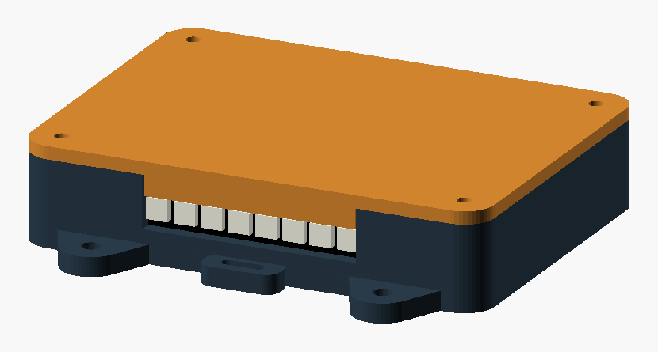
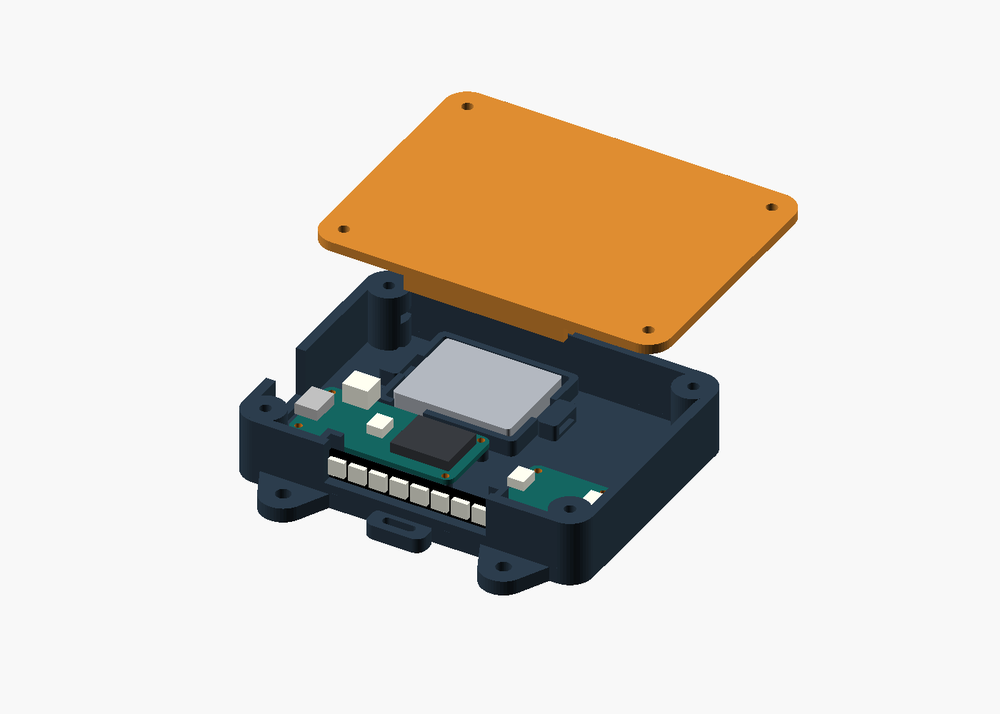
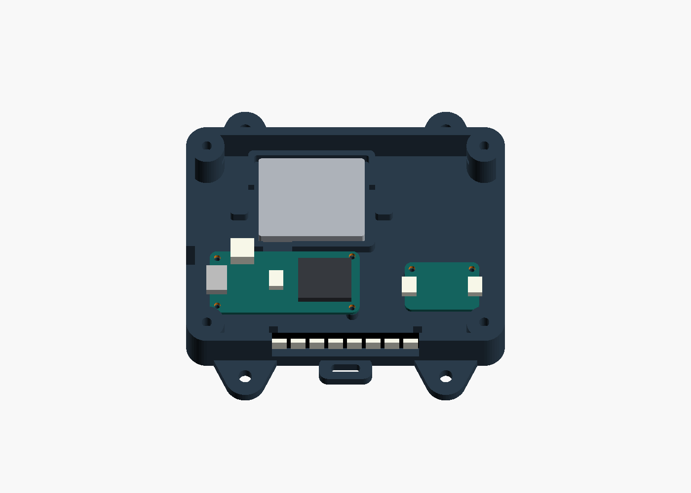

# PLA enclosure for Judgy Skateboard

Open **[skate-judge.scad](skate-judge.scad)** in **OpenSCAD 2021.01 or newer**.
This is a printable prototype for the project's Feather ESP32-S3, LSM6DSO32,
500 mAh LiPo and an eight-pixel sync stick mounted **inside the long side wall**.
It needs a physical fit check
and progressive riding trials; CAD checks do not establish impact survival.



The LED PCB slides down into a channel from the open top. The screwed-on lid
retains it; the eight pixels face outward through a recessed side opening.
There is no separate LED guard to print, no external LED cable, and no PLA snap.
The previous separate-guard STL has been removed from this package. Reprint
**both the base and lid** for this revision; it is not a clip-on retrofit.

## Mounting choice

**Use a rigid deck mount for motion recording.** The default base has four broad
4.5 mm-thick lugs with 4.5 mm clearance holes, a flat deck-facing back, and two
tether slots. The lid faces away from the deck and is removable while mounted.
Nominal shell dimensions are **108 × 80 × 23 mm**, excluding screw heads;
the lugs increase the footprint to **108 × 106 mm**. Place its long axis along
the deck, inboard of a truck, with the LED side facing the camera and clearance
checked on your actual board. Confirm that the deck overhang does not hide the
LEDs at the intended camera height; a side window alone does not establish visibility.
No deck curvature, truck geometry, or wheel sweep was supplied.

| Attachment | Use with this model |
| --- | --- |
| Deck screws/bolts | Preferred for rigid IMU coupling. Four M4 through-bolts, washers and locking nuts through suitable deck holes and the lugs. Hole centers form a 68 × 92 mm rectangle. Choose length for the measured deck, 4.5 mm lugs, washers and full nut engagement. This is a new mounting pattern, **not truck-bolt spacing**. |
| Adhesive hook-and-loop | Use `base-velcro.stl` or the standard base. Its flat back accepts two roughly 20 × 60 mm strips. The earless version is 108 × 94 mm including tether lugs. Use a secondary tether; check tape compatibility with the deck finish and leave tether slots clear. Hook-and-loop compliance can introduce motion artifacts, so compare a recording against a rigid mount. |
| PLA truck snap | Not selected. A stressed snap is a poor match for brittle PLA under repeated skate impacts. The hanger also steers relative to the deck. A future truck adapter should attach to the fixed baseplate using measured geometry and appropriate hardware, and use a tougher material; this design does not alter truck hardware or add a PLA riser to that joint. |

The PLA decision is an engineering judgment based on [Prusa's material guidance](https://help.prusa3d.com/article/pla_2062): PLA is brittle, has weak impact/layer resistance,
and can deform above about 60 °C. This enclosure uses thick walls and broad lugs,
with no spring clips or constantly flexed latches. Keep it out of hot cars and
direct heat. For a durable riding version, reconsider the material and validate
the printed parts rather than relying on PLA geometry alone.

Do not use ordinary short wood screws as an assumed universal skate-deck mounting
solution: the deck thickness, condition, screw penetration and placement need to
be checked first. Do not compromise existing truck holes or crush the deck with
fasteners. Match a curved deck using fitted **rigid** shims under the lugs; do not
pull a flat enclosure into the concave with screw torque. The flat Velcro back
likewise needs enough actual contact area on your deck.

## Parts to print

| STL | Quantity | Print orientation |
| --- | --- | --- |
| [base.stl](exports/base.stl) | 1 | Flat deck-facing back on bed, cavity up |
| [base-velcro.stl](exports/base-velcro.stl) | Alternative to base | Same; ears omitted, tether lugs retained |
| [lid.stl](exports/lid.stl) | 1 | Flat exterior face on bed, guide ribs up |
| [fit-coupon.stl](exports/fit-coupon.stl) | 1 first | Flat back on bed |

Exported files already have those orientations and use millimeters. The LED mount
fits inside the existing shell footprint. `layout` is for visual inspection;
arrange individual STLs for your printer's bed.
Do not print `assembly` or `exploded`: those views include illustrative electronics.

Start with a 0.4 mm nozzle, 0.20 mm layers, **5 perimeters**, 6 top/bottom layers,
and 35–45% gyroid infill. Use solid local infill around lugs, lid bosses and PCB
posts if the slicer leaves voids there. Use your filament's calibrated PLA profile.
Nut entries and strap tunnels require short bridges (about 5.8 and 8.4 mm).
**PrusaSlicer 2.9.6 flagged "Floating bridge anchors" on the base** during the
0.20 mm/5-perimeter slice check. Support-free printing is therefore unverified:
inspect those areas layer by layer, and test a cropped boss/strap-anchor section
or paint removable local supports with accessible removal paths. Do not assume
that support inside a captive-nut pocket will be easy to remove. The supplied
coupon checks screw/nut dimensions; it does **not** reproduce those roof bridges.
The LED window is open to the rim in the base; its upper frame prints as part of
the lid. The rear LED guides have 45-degree ramps. These avoid a roughly 50 mm
window-roof bridge when printing the base flat.
The 0.3 mm lid clearance is **per side**. Deburr openings that contact wires.
The default lid is plain. Optional `lid_markings=true` engraves the exterior;
that version triggered a long-bridge warning in PrusaSlicer and is not the
supplied print default.

## Hardware and assembly

- Four **M3 × 12 mm machine screws**, preferably button/pan head, and four ordinary
  **M3 hex nuts** for the lid. Nut cavities allow 5.8 mm across flats × 2.8 mm height;
  these are not sized for nyloc nuts. Nuts load horizontally from inside the open
  base, 11 mm above its back. Seat them at the end of each channel before fitting
  the lid. The screw cannot reach the battery bay. Snug by hand; do not torque
  a metal fastener hard against PLA. Recheck after early rides.
- Six **M2 × 5 mm screws suitable for plastic pilots**: four for the Feather,
  two for the IMU. Nominal pilot is 1.7 mm, blind, with 4 mm standoffs.
  Test the coupon's 1.6/1.7/1.8 mm pilots with your actual screw; change
  `pcb_pilot_diameter` if needed. These are not pre-tapped M2 machine threads.
  Avoid oversized heads touching components/traces, particularly at the Feather's
  smaller rear holes. Confirm screw engagement without bottoming or splitting posts.
- An **8 mm-wide soft fabric strap**, with a closure that fits inside the shell,
  through the battery anchors; about 100 mm of strap allows trimming to fit.
  Place approximately 0.8 mm of nonconductive soft padding under the pouch and
  secure it loosely so it cannot slide or rattle. No zip tie cinched around the cell.
- Small cable ties for strain relief, electrical insulation at exposed joints,
  and a short secondary tether secured to a fixed point clear of wheels and truck
  movement. It should prevent the enclosure reaching a wheel if the primary mount fails.
- Deck mounting fasteners/adhesive as chosen above; their lengths depend on your deck.
- No extra LED mounting screws or adhesive are required for the nominal bare PCB:
  the channel constrains it and the main lid stops upward travel. Optionally add
  a **54 × 11 × 0.5 mm clear polycarbonate cover**, centered over the side window.
  Bond its ends and lower edge to the **base only**, using a compatible adhesive;
  keep it free of the removable lid's window header. This is a separately cut
  cover, not a printed PLA part or a supplied STL, and it does not make a seal.

1. Print the coupon and check screw/nut fit. Inspect the base for cracks, poor
   bridges and layer separation. Fit the empty base and lid before electronics.
2. With power disconnected, screw both PCBs to their posts. The Feather USB points
   toward the **x=0 short wall**. Its battery connector faces the battery bay;
   the IMU header row faces that bay too. Route the STEMMA cable in the free space
   between boards. Record the real IMU silkscreen axes in `--mounting`; enclosure
   X/Y coordinates do not establish the sensor's firmware axes.
3. Pad and strap the battery in its separate tray, leaving its wrapped end and
   lead unstressed. Route the lead through the tray notch toward the Feather.
   Keep loose wiring out of the lid and captive-nut channels. Tall plug-in headers
   are not assumed by this layout.
4. Solder and insulate the LED leads before inserting the stick. Slide the bare
   PCB down the channel along the **y=0 long wall**, pixels facing **negative Y**
   (outward), with the pad row toward the channel floor. It rests 5.5 mm above
   the enclosure back; do not force it past wires or solder bumps. Route leads
   through the open rear of the channel into the case, using the relief beneath
   the rear guides for the end pads. Tie the insulated cable bundle to the anchor
   near **(18.15, 8)**, with slack between anchor and solder joints. It must not
   obstruct the adjacent Feather, lid guides, or the LED's vertical insertion path.
5. Fit the lid. Its front header finishes the LED opening; a separate internal
   stop leaves 0.3 mm above the PCB and prevents it lifting out. Confirm the
   board is retained without being clamped, and all eight LEDs remain unobstructed.
   The other tongue closes the USB slot. The USB
   opening is **16 × 10 mm**; verify your actual USB-C plug housing reaches the
   recessed connector without loading the PCB. Buttons and the battery plug are
   accessed by removing the lid; no external power switch is assumed.
6. Aim this long side of the enclosure toward the camera. Check actual recorded
   sync flashes from the intended camera position, with the deck in place and
   optional clear cover fitted. Recessed pixels have a narrower viewing angle
   than an exposed stick; rotate/reposition the enclosure if the deck hides them.
7. Check clearance with the trucks fully steered, deck loaded/flexed and wheels
   near wheelbite. Keep the housing and LED window away from grind/slide contact.
   This PLA shell is not a grind plate or a verified battery crash enclosure.
   Start with a stationary Wi-Fi/LED check, then low-speed riding and inspection
   before progressively harder trials. Remove it for slides that would strike it.

The ports, seam and porous print are **not waterproof**. The battery must remain
removable and free of crushing loads; stop using a damaged or swollen cell.
The default has no boost-converter or level-shifter mounting, matching the
project's direct-LiPo wiring. Rework the layout if that circuitry is added.

## Dimensions and assumptions





The PCB outline and hole locations were read from the manufacturer's mechanical
files, not measured from the wiring illustration. Values below are relative to
each PCB's outline, in a top view using the Eagle coordinates.

| Item | Default / source |
| --- | --- |
| Feather ESP32-S3 8 MB / no PSRAM | 50.8 × 22.86 mm PCB; front holes (2.54, 2.54), (2.54, 20.32); rear holes (48.26, 1.8415), (48.26, 20.955), rear drill 2.2 mm. [Official PCB](https://github.com/adafruit/Adafruit-Feather-ESP32-S3-PCB/blob/main/Adafruit%20ESP32-S3%208MB%20No%20PSRAM.brd), [downloads](https://learn.adafruit.com/adafruit-esp32-s3-feather/downloads). |
| IMU | 25.4 × 17.78 mm PCB; two holes at (2.54, 15.24), (22.86, 15.24). Uses the [LSM6DSOX family PCB](https://github.com/adafruit/Adafruit-LSM6DSOX-PCB/blob/master/Adafruit_LSM6DSOX.brd) linked from the [combined IMU guide](https://learn.adafruit.com/lsm6dsox-and-ism330dhc-6-dof-imu/downloads), cross-checked against the bundled LSM6DSO32 Fritzing part. Confirm your revision. |
| LiPo | **Assumed 36 × 29 × 5 mm**, with 1.5 mm free space per side: a 39 × 32 mm bay. Reference [Adafruit 1578](https://www.adafruit.com/product/1578) is 36 × 29 × 4.75 mm. Your exact 500 mAh cell is unidentified; measure the complete wrap/protection end and lead bend. Capacity alone does not establish size. |
| RGB stick | 51.1 × 10.22 × approximately 3.2 mm from [Adafruit 1426](https://www.adafruit.com/product/1426). The channel assumes a 1.6 mm PCB, 0.3 mm clearance per end and per face; solder bumps/wires and variants need a fit check. Nominal pixel faces are recessed 1.9 mm behind the exterior wall. |

Sources checked 2026-09-07. PCB, connector, battery and LED shapes in the colored
views are **simplified placement envelopes**, not detailed STEP models. They do
not prove connector, solder joint, header, fastener-head or cable-bend clearance.

Change the variables at the top of the SCAD file or in the Customizer. Increase
`case_width` if a larger battery fails the tray assertion. `body_height` can be
increased for headers, but check the real assembly and USB position; the echo
prints the lid screw length (12 mm for the default). Moving the standoffs changes
USB height and needs port adjustment too. Changing layout dimensions requires
fresh geometry and physical checks. The supplied STLs contain **only defaults**.
`stick_clearance` controls the LED's end clearance. The hidden
`led_pcb_thickness` assumption and the channel faces need adjustment if the real
PCB is thicker/thinner than 1.6 mm; increasing `stick_height` only changes the
illustrative component envelope. Do not add a back pad that makes the slide-in
channel a press fit. The nominal bare-PCB channel is 51.7 mm long × 2.2 mm deep.

## Rebuild and verification

From the repository root, export to a new directory:

```bash
python3 hardware/enclosure/build.py --output /tmp/judgy-enclosure
```

Use `--openscad /path/to/openscad` if necessary. On this Mac, the current version
is `/Applications/OpenSCAD-2021.01.app/Contents/MacOS/OpenSCAD`; the similarly named
`OpenSCAD.app` is the older 2015 release. To deliberately regenerate the checked-in
default outputs, use `--replace`. This only replaces this generator's named files.

In the GUI, select `base`, `lid` or `fit_coupon` using `part`, then
**F6 → File → Export → Export as STL**. `assembly` and `exploded` are viewing modes.
`interior` shows the PCB and battery layout without the lid. `mount_ears=false`
selects the Velcro base.

The build script runs real OpenSCAD CGAL exports and checks each STL for paired
edges, consistent winding, a single connected surface, positive signed volume
and z=0 placement. Results are in [validation.json](exports/validation.json).
Rendered views were visually reviewed. Print quality, exact hardware fit, deck
clearance, RF performance and riding loads still require the physical checks above.

Additional CAD checks found no overlap of the revised base with the simplified
electronics (including the vertical LED stick), or with the lid, after lifting the seated items by 0.02 mm to exclude
their intentional contact faces. This is a nominal geometry check, not a clearance
guarantee for unmodeled components. PrusaSlicer 2.9.6 also imported the main base and
lid as single manifold parts and generated toolpaths with the print
settings above. The base's bridge warning remains as described under printing.
The trial G-code uses generic settings and is not supplied as printer-ready output.
