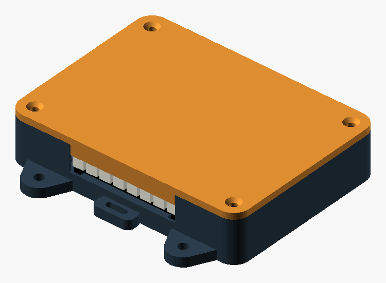
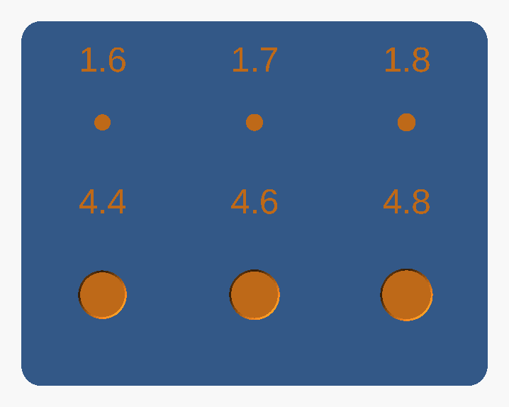
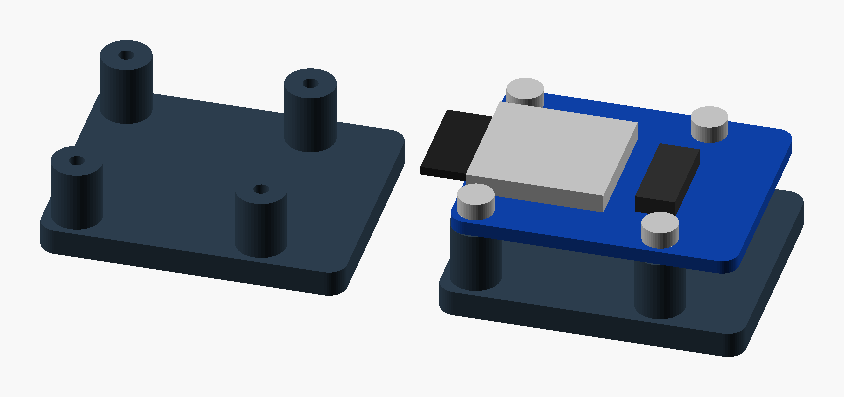
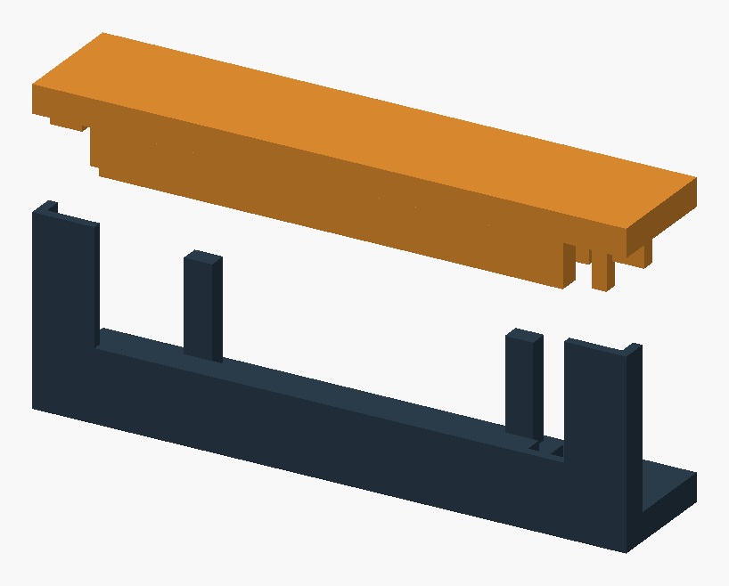
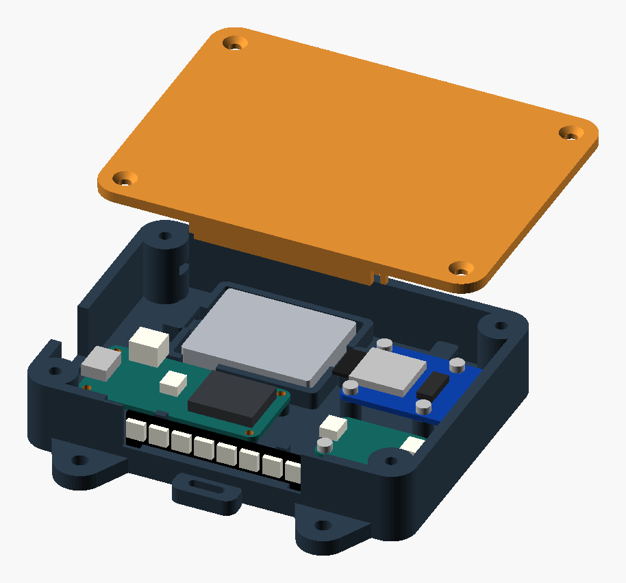
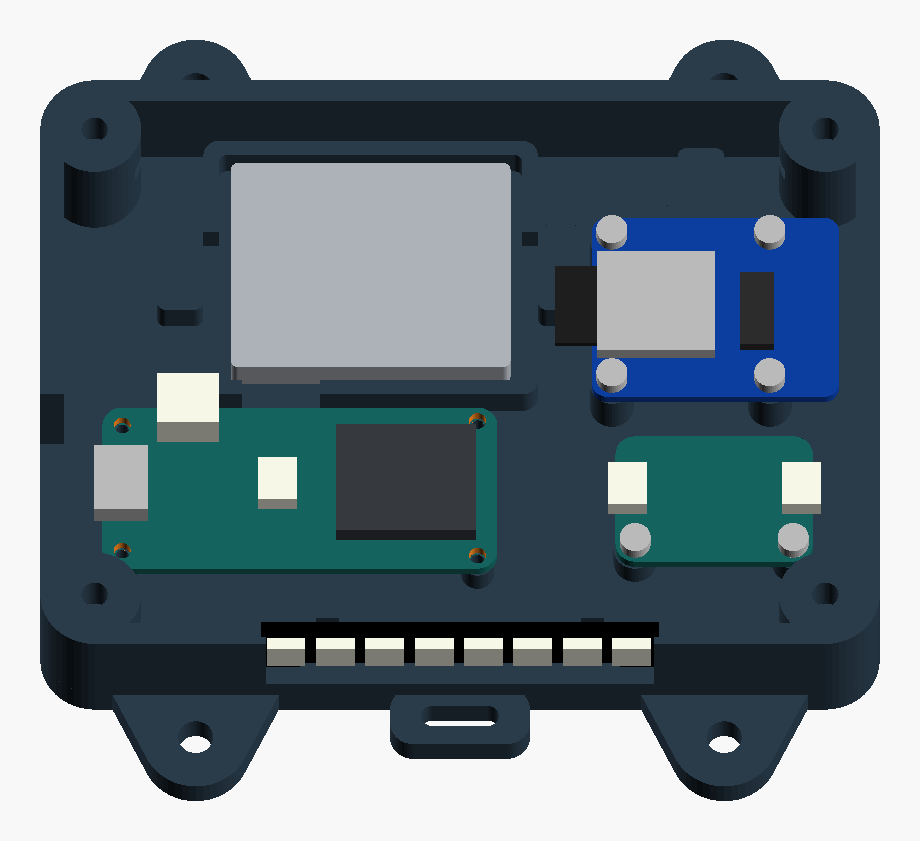

# PLA enclosure for Judgy Skateboard

Open **[skate-judge.scad](skate-judge.scad)** in **OpenSCAD 2021.01 or newer**.
This is a printable prototype for the project's Feather ESP32-S3, LSM6DSO32,
500 mAh LiPo, Adafruit 254 microSD breakout and an eight-pixel sync stick mounted
**inside the long side wall**.
It needs a physical fit check
and progressive riding trials; CAD checks do not establish impact survival.



**Revision 8 — 2026-10-03, heat-set inserts for the lid.** Both bases now use
four top-loaded **M3 × 4 × 5 mm inserts** in place of the side-loaded hex nuts.
The user confirmed the Jouth size as **M3 thread, 4 mm length,
5 mm outside diameter**. A Jouth recommended hole size was not available;
check the printed fit with the coupon before printing the base.
The starting bore is **4.6 mm diameter × 5 mm deep**, with a **0.2 mm entry bevel**
opening to 5.0 mm. Install inserts flush with the boss tops. The existing 12 mm
boss diameter leaves 3.5 mm of plastic radially around a 5 mm insert; the side
nut channels are filled in. A **3.4 mm screw-tip clearance bore extends 10 mm
below the boss top**, so existing M3 × 12 mm countersunk screws retain nominal
1 mm tip clearance with the 3 mm lid. M3 × 8 mm screws also reach the full insert.

**Reprint only the base**: [standard base](exports/base.stl) or
[Velcro base](exports/base-velcro.stl). The lid geometry and hole centers are
unchanged. Print the revised **[fit coupon](exports/fit-coupon.stl)** first:
its three full-height bosses have labeled **4.4 / 4.6 / 4.8 mm** insert bores,
the same depth, bevel and screw relief as the base, and separate M2 pilot tests.
Use the same filament, orientation and wall settings as the base. Choose the
fit that heat-sets squarely and holds without splitting or spinning after cooling;
change `lid_insert_bore_diameter` and rebuild if the center bore is not the best
fit. A CAD clearance check does not establish heat-set retention.



**Revision 7 — 2026-10-02, power-switch cutout beside USB.** Both bases now
have a **13.5 mm wide × 8.4 mm high** rectangular opening in the **x=0 short
wall**, on the same side as USB. This uses the measured **13.27 × 8.18 mm**
KCD11-101 style switch body with **0.23 × 0.22 mm total clearance**; no further
fit allowance is added. The opening is centered at **Y=50, Z=11.5 mm**, spanning
Y=43.25–56.75 and Z=7.3–15.7 mm. It leaves **7.82 mm of wall between the USB
and switch openings**, and 4.3 mm of material above and below the opening
between the floor and rim. **Only the base needs reprinting**; use the refreshed
[base](exports/base.stl) or [Velcro base](exports/base-velcro.stl). The lid still fits.

The switch inserts through the existing **3 mm wall**. Check the actual snap
clips, bezel, body depth, terminals and insulated wire bends against the battery
tray/strap anchor before assembly; only the supplied body cross-section is known.
The cutout adds a **13.5 mm roof bridge** to the base, so inspect that bridge in
the slicer and check the printed opening with your switch.

**Revision 6 — 2026-09-26, preserve the installed IMU orientation.** The user
confirmed that the IMU extends from its two screws toward the SD board, with
components facing the lid. In that orientation, the old screw positions put
the IMU into the SD mounting posts. R6 moves both IMU posts **12.7 mm toward
the LED window**: centers are now **(76.54, 19.54)** and **(96.86, 19.54)**,
instead of Y=32.24. Slide the physical IMU toward the LEDs without turning it.
Its two screws now sit on the LED side of its PCB; the PCB extends toward SD.
This corrects the previous drawing's orientation assumption.

The IMU posts remain **4 mm high** and the SD posts **7 mm high** above the
floor. There is **4.22 mm nominal separation between the PCB outlines**.
Changing heights is unnecessary; lowering SD would reduce the card-removal
clearance above the battery. **Only the base needs reprinting**; the lid and
SD mounting sample are unchanged. Use the refreshed [base](exports/base.stl)
or [Velcro base](exports/base-velcro.stl). The current R8 exports retain this layout.

Existing recordings remain in their original sensor axes. Keeping the same
physical orientation avoids a new axis mapping, but translating the sensor can
change the acceleration measured during rotations. Record the R6 mount revision
and 12.7 mm position shift alongside subsequent sessions; do not overwrite old
session mounting descriptions or rotate their raw samples to match a CAD image.
If the sensor is physically rotated in a future revision, retain the originals
and apply the measured sensor-to-deck rotation to both acceleration and gyro
during analysis. The existing overlay tools support explicit nose/up axis mapping.

**Revision 5 — 2026-09-26, screw-mounted microSD breakout.** Four 7 mm-high posts
secure the Adafruit 254 board beside the battery, with a separate wire tie point.
The enclosure dimensions stay the same. **Reprint only the base if you already
have an R3/R4 lid**; the R4 lid geometry is unchanged. The SD card slides toward
the battery for removal with the lid off. Its path is raised above the assumed
5 mm-thick cell; keep the battery strap and wires out of that path.

Print the [SD mounting sample](exports/sd-fit-base.stl) first to check all four
holes and your screws. It is **33.75 × 27.4 × 10 mm**, with the same post heights
and pilots as the full base. Use four **M2 × 5 mm screws suitable for plastic**,
with heads no larger than **4 mm diameter × 2 mm high**. This is for the
Adafruit 254 hole pattern (20.32 mm square); check your actual board against it.
The sample checks mounting fit, not the complete wiring or card-removal path.



**Revision 4 — 2026-09-15, DIN 7991 M3 flat-head lid screws.** All four lid holes
now have a **6.4 mm exterior opening, 90° included bevel and 1.5 mm recess depth**,
with the existing 3.4 mm shaft clearance. This leaves 1.5 mm of the 3 mm lid
beneath each bevel. DIN 7991 M3 heads are 6 mm across with a 90° bevel
([supplier drawing](https://belmetric.com/content/A-PDF_Drawings/SF3X6SS.pdf));
the opening adds 0.4 mm of diameter for printed fit. Check seating with your
actual screws; diameter and angle remain adjustable. The R4 lid fits the R3
base, so only the lid needs reprinting for this change.

**Revision 3 — 2026-09-08, fixes from the first physical print.** The previous
lid preview reflected the printed part instead of rotating it into place. This
hid the reversed position of its asymmetric wall-closing tabs. The lid STL now
accounts for the physical flip; neither the preview nor the fit check reflects
the printed lid into place.

The LED PCB slides down into a channel from the open top. The screwed-on lid
retains it; the eight pixels face outward through a recessed side opening.
Both ends now have actual **open-top through-slots for soldered leads**. Rear
guides are moved away from the solder zones, and the lid locates the PCB's
unsoldered upper corners. It leaves 0.8 mm above the board instead of 0.3 mm.

Print the [LED fit sample base](exports/led-fit-base.stl) and
[matching sample lid](exports/led-fit-lid.stl) first, and try your **soldered**
stick. These reproduce the entire holder and its lid features in a
**63.1 × 13 mm footprint**; hold the lid seated by hand. They do not test the
USB tab or full enclosure screw alignment. When upgrading from R2, print **both
the revised full base and lid**. R3/R4 lid corner locators occupy the old end-stop
positions; do not mix R3/R4 parts with the unmodified R2 base/lid.



## Mounting choice

**Use a rigid deck mount for motion recording.** The default base has four broad
4.5 mm-thick lugs with 4.5 mm clearance holes, a flat deck-facing back, and two
tether slots. The lid faces away from the deck and is removable while mounted.
Nominal shell dimensions are **108 × 80 × 23 mm**, excluding screw heads;
the lugs increase the footprint to **108 × 106 mm**. Place its long axis along
the deck, inboard of a truck, with the LED side facing the camera and clearance
checked on your actual board. Confirm that the deck overhang does not hide the
LEDs at the intended camera height; a side window alone does not establish visibility.
No deck curvature, truck geometry, or wheel sweep was supplied.

| Attachment | Use with this model |
| --- | --- |
| Deck screws/bolts | Preferred for rigid IMU coupling. Four M4 through-bolts, washers and locking nuts through suitable deck holes and the lugs. Hole centers form a 68 × 92 mm rectangle. Choose length for the measured deck, 4.5 mm lugs, washers and full nut engagement. This is a new mounting pattern, **not truck-bolt spacing**. |
| Adhesive hook-and-loop | Use `base-velcro.stl` or the standard base. Its flat back accepts two roughly 20 × 60 mm strips. The earless version is 108 × 94 mm including tether lugs. Use a secondary tether; check tape compatibility with the deck finish and leave tether slots clear. Hook-and-loop compliance can introduce motion artifacts, so compare a recording against a rigid mount. |
| PLA truck snap | Not selected. A stressed snap is a poor match for brittle PLA under repeated skate impacts. The hanger also steers relative to the deck. A future truck adapter should attach to the fixed baseplate using measured geometry and appropriate hardware, and use a tougher material; this design does not alter truck hardware or add a PLA riser to that joint. |

The PLA decision is an engineering judgment based on [Prusa's material guidance](https://help.prusa3d.com/article/pla_2062): PLA is brittle, has weak impact/layer resistance,
and can deform above about 60 °C. This enclosure uses thick walls and broad lugs,
with no spring clips or constantly flexed latches. Keep it out of hot cars and
direct heat. For a durable riding version, reconsider the material and validate
the printed parts rather than relying on PLA geometry alone.

Do not use ordinary short wood screws as an assumed universal skate-deck mounting
solution: the deck thickness, condition, screw penetration and placement need to
be checked first. Do not compromise existing truck holes or crush the deck with
fasteners. Match a curved deck using fitted **rigid** shims under the lugs; do not
pull a flat enclosure into the concave with screw torque. The flat Velcro back
likewise needs enough actual contact area on your deck.

## Parts to print

| STL | Quantity | Print orientation |
| --- | --- | --- |
| [base.stl](exports/base.stl) | 1 | Flat deck-facing back on bed, cavity up |
| [base-velcro.stl](exports/base-velcro.stl) | Alternative to base | Same; ears omitted, tether lugs retained |
| [lid.stl](exports/lid.stl) | 1 | Flat exterior face on bed, guide ribs up |
| [fit-coupon.stl](exports/fit-coupon.stl) | 1 first | Flat back on bed, insert bosses upward; 46 × 36 × 20 mm |
| [led-fit-base.stl](exports/led-fit-base.stl) | 1 first | Flat bottom on bed, slot upward |
| [led-fit-lid.stl](exports/led-fit-lid.stl) | 1 first | Flat exterior on bed, tabs upward |
| [sd-fit-base.stl](exports/sd-fit-base.stl) | 1 first | Flat bottom on bed, posts upward |

Exported files already have those orientations and use millimeters. The LED mount
fits inside the existing shell footprint. `layout` is for visual inspection;
arrange individual STLs for your printer's bed.
Do not print `assembly` or `exploded`: those views include illustrative electronics.

Start with a 0.4 mm nozzle, 0.20 mm layers, **5 perimeters**, 6 top/bottom layers,
and 35–45% gyroid infill. Use solid local infill around lugs, lid bosses and PCB
posts if the slicer leaves voids there. Use your filament's calibrated PLA profile.
The R8 insert bores open upward and remove the old nut-pocket roof bridges.
Strap/wire-anchor tunnels still require approximately 8.4 mm bridges, and the
switch opening has a 13.5 mm roof bridge. **PrusaSlicer 2.9.6 flagged "Floating
bridge anchors" on earlier bases** during the 0.20 mm/5-perimeter slice check.
Support-free printing of R8 is unverified: inspect those remaining spans layer
by layer, and test a cropped anchor section or paint removable local supports
with accessible removal paths. The insert coupon reproduces the boss depth and
bores, but does **not** test the strap or switch bridges.
The LED window is open to the rim in the base; its upper frame prints as part of
the lid. The rear LED guides rise from the floor, inboard of the solder zones.
The end wire slots are open to the top, so they introduce no roof bridges.
The 0.3 mm lid clearance is **per side**. Deburr openings that contact wires.
The countersink openings face the bed and taper inward as the lid prints.
The default lid has no markings. Optional `lid_markings=true` engraves the exterior;
that version triggered a long-bridge warning in PrusaSlicer and is not the
supplied print default.

## Hardware and assembly

- Four **M3 heat-set inserts, 4 mm long × 5 mm outside diameter**, and four
  **DIN 7991 M3 flat-head machine screws**. Use **8 mm overall length**, or reuse
  the existing **12 mm** screws after checking tip clearance. Countersunk screw
  length includes the head. With a flush head and the 3 mm lid, an 8 mm screw
  projects 5 mm into the boss and a 12 mm screw projects 9 mm; the blind relief
  ends at 10 mm. Smaller heads can seat below flush and move the tip deeper.
  Confirm full insert engagement and that the screw clamps the lid before it
  bottoms. Heat-set inserts squarely from above, **flush with the boss top**,
  with electronics and battery removed. Follow your insert/filament installation
  guidance, test on the coupon, and let the inserts cool before threading screws.
  Clear any raised plastic so the lid seats flat. No hex nuts are used in R8.
  Snug by hand; do not torque a metal fastener hard against PLA. Recheck after
  early rides.
- Ten **M2 × 5 mm screws suitable for plastic pilots**: four for the Feather,
  two for the IMU, four for the SD breakout. Nominal pilot is 1.7 mm, blind,
  with 4 mm standoffs for the Feather/IMU and 7 mm for SD.
  Test the coupon's 1.6/1.7/1.8 mm pilots with your actual screw; change
  `pcb_pilot_diameter` if needed. These are not pre-tapped M2 machine threads.
  Avoid oversized heads touching components/traces, particularly at the Feather's
  smaller rear holes. Confirm screw engagement without bottoming or splitting posts.
- An **8 mm-wide soft fabric strap**, with a closure that fits inside the shell,
  through the battery anchors; about 100 mm of strap allows trimming to fit.
  Place approximately 0.8 mm of nonconductive soft padding under the pouch and
  secure it loosely so it cannot slide or rattle. No zip tie cinched around the cell.
- Small cable ties for strain relief, electrical insulation at exposed joints,
  and a short secondary tether secured to a fixed point clear of wheels and truck
  movement. It should prevent the enclosure reaching a wheel if the primary mount fails.
- Deck mounting fasteners/adhesive as chosen above; their lengths depend on your deck.
- No extra LED mounting screws or adhesive are required for the nominal bare PCB:
  the channel constrains it and the main lid stops upward travel. Optionally add
  a **54 × 11 × 0.5 mm clear polycarbonate cover**, centered over the side window.
  Bond its ends and lower edge to the **base only**, using a compatible adhesive;
  keep it free of the removable lid's window header. This is a separately cut
  cover, not a printed PLA part or a supplied STL, and it does not make a seal.

1. Print the insert/pilot coupon, SD mounting sample and the two LED fit samples.
   Confirm insert dimensions, test heat-setting and screw engagement after cooling.
   Select the bore size before printing the full base, then install all four
   inserts in the empty base. Check the SD board rests flat on all four posts
   and each screw engages gently.
   Check the complete
   wired stick drops into the sample and the sample lid seats without force.
   Then print and inspect the full parts. Turn the full lid over to face its tabs
   into the cavity, lining up the wide LED header with the LED opening and the
   USB tab with the USB cutout. **Do not mirror the STL in the slicer.** Fit the
   empty base and lid, then repeat with the wired electronics before tightening.
2. With power disconnected, screw the Feather, IMU and SD PCBs to their posts. The Feather USB points
   toward the **x=0 short wall**. Its battery connector faces the battery bay.
   The IMU components face the lid, with the PCB extending from its screw row
   toward the SD breakout. Keep the physical orientation used for recordings;
   slide it 12.7 mm toward the LEDs to reach the new posts. Route the STEMMA cable in the free space
   between boards. Record the real IMU silkscreen axes in `--mounting`; enclosure
   X/Y coordinates do not establish the sensor's firmware axes.
   The SD board sits at the opposite end from USB, beside the battery: card socket
   faces inward toward the battery, solder/header row toward the **x=108 wall**.
   Use insulated, flexible stranded leads with a little slack at the joints.
   Tie the wire bundle to the anchor at **(85, 70)**, clear of the lid boss and
   card slot. The mount prevents the PCB moving; it cannot repair a cracked joint
   or prevent stiff solid wires from loading their solder joints.
3. Pad and strap the battery in its separate tray, leaving its wrapped end and
   lead unstressed. Route the lead through the tray notch toward the Feather.
   Keep loose wiring clear of the lid seam and screw bosses. Tall plug-in headers
   are not assumed by this layout.
4. Solder and insulate the LED leads before inserting the stick. Slide the bare
   PCB down the channel along the **y=0 long wall**, pixels facing **negative Y**
   (outward), with the pad row toward the channel floor. It rests 5.5 mm above
   the enclosure back. Drop the solder joints and wires down the **open-top slot
   at either end**, and route them through that slot into the case. Each slot
   crosses the old end wall and extends 5 mm beyond and 5 mm inside the nominal
   PCB end. It runs from y=1 to y=11 mm and from z=4 mm up to the rim. Keep the
   joints and exiting leads below **z=11.5 mm** so the lid's upper-corner stops
   pass above them. The fit fixture allows a **9 × 9 × 7 mm envelope per end**,
   with 0.5 mm clearance to slot walls; this is an assumption to check against
   your soldering, not a measured wire model. Tie the insulated cable bundle to the anchor
   near **(18.15, 8)**, with slack between anchor and solder joints. It must not
   obstruct the adjacent Feather, lid guides, or the LED's vertical insertion path.
5. Fit the lid. Its front header finishes the LED opening; a separate internal
   stop leaves 0.8 mm above the PCB and prevents it lifting out. The two corner
   locators limit lengthwise movement without blocking the lower wire slots. Confirm the
   board is retained without being clamped, and all eight LEDs remain unobstructed.
   The other tongue closes the USB slot. The USB
   opening is **16 × 10 mm**; verify your actual USB-C plug housing reaches the
   recessed connector without loading the PCB. Buttons and the battery plug are
   accessed by removing the lid. The adjacent **13.5 × 8.4 mm** opening accepts
   the measured power-switch body from outside the x=0 wall. Check retention in
   the 3 mm wall and clearance for the actual terminals and wiring before fitting
   the lid. This revision adds the mounting cutout; electrical wiring is separate.
6. Aim this long side of the enclosure toward the camera. Check actual recorded
   sync flashes from the intended camera position, with the deck in place and
   optional clear cover fitted. Recessed pixels have a narrower viewing angle
   than an exposed stick; rotate/reposition the enclosure if the deck hides them.
7. Check clearance with the trucks fully steered, deck loaded/flexed and wheels
   near wheelbite. Keep the housing and LED window away from grind/slide contact.
   This PLA shell is not a grind plate or a verified battery crash enclosure.
   Start with a stationary Wi-Fi/LED check, then low-speed riding and inspection
   before progressively harder trials. Remove it for slides that would strike it.

The ports, seam and porous print are **not waterproof**. The battery must remain
removable and free of crushing loads; stop using a damaged or swollen cell.
The default has no boost-converter or level-shifter mounting, matching the
project's direct-LiPo wiring. Rework the layout if that circuitry is added.

## Dimensions and assumptions





The PCB outline and hole locations were read from the manufacturer's mechanical
files, not measured from the wiring illustration. Values below are relative to
each PCB's outline, in a top view using the Eagle coordinates.

| Item | Default / source |
| --- | --- |
| Feather ESP32-S3 8 MB / no PSRAM | 50.8 × 22.86 mm PCB; front holes (2.54, 2.54), (2.54, 20.32); rear holes (48.26, 1.8415), (48.26, 20.955), rear drill 2.2 mm. [Official PCB](https://github.com/adafruit/Adafruit-Feather-ESP32-S3-PCB/blob/main/Adafruit%20ESP32-S3%208MB%20No%20PSRAM.brd), [downloads](https://learn.adafruit.com/adafruit-esp32-s3-feather/downloads). |
| IMU | 25.4 × 17.78 mm PCB; two holes at (2.54, 15.24), (22.86, 15.24). Uses the [LSM6DSOX family PCB](https://github.com/adafruit/Adafruit-LSM6DSOX-PCB/blob/master/Adafruit_LSM6DSOX.brd) linked from the [combined IMU guide](https://learn.adafruit.com/lsm6dsox-and-ism330dhc-6-dof-imu/downloads), cross-checked against the bundled LSM6DSO32 Fritzing part. Confirm your revision. |
| microSD breakout | Adafruit 254: **31.75 × 25.4 mm PCB** from the [official Eagle file](https://github.com/adafruit/MicroSD-breakout-board/blob/master/microsd.brd); four 2.2 mm holes at (2.54, 2.54), (2.54, 22.86), (22.86, 2.54), (22.86, 22.86). The holes form a **20.32 × 20.32 mm square**, not equal corner insets. PCB underside is 10 mm above the case back; origin (71, 39). The [product page](https://www.adafruit.com/product/254) rounds the length differently (31.85 mm); verify the actual board. |
| LiPo | **Assumed 36 × 29 × 5 mm**, with 1.5 mm free space per side: a 39 × 32 mm bay. Reference [Adafruit 1578](https://www.adafruit.com/product/1578) is 36 × 29 × 4.75 mm. Your exact 500 mAh cell is unidentified; measure the complete wrap/protection end and lead bend. Capacity alone does not establish size. |
| RGB stick | 51.1 × 10.22 × approximately 3.2 mm from [Adafruit 1426](https://www.adafruit.com/product/1426). The channel assumes a 1.6 mm PCB, 0.3 mm clearance per end and per face; solder bumps/wires and variants need a fit check. Nominal pixel faces are recessed 1.9 mm behind the exterior wall. |

SD source checked 2026-09-26; other sources checked 2026-09-07. PCB, connector, battery and LED shapes in the colored
views are **simplified placement envelopes**, not detailed STEP models. They do
not prove connector, solder joint, header, fastener-head or cable-bend clearance.

Change the variables at the top of the SCAD file or in the Customizer. A larger
battery requires rechecking the SD posts, strap anchor and card path as well as
the tray; simply increasing the shell size does not relocate those features.
`sd_standoff` sets the SD post height. `show_sd_clearances=true` shows the assumed
card-removal and soldered-lead volumes. The lead envelope is 3 × 20.6 mm in plan,
from 1.5 mm below the PCB to 6 mm above its underside; tall plug-in headers are
not included. With the default battery there is 3 mm nominal clearance below
the card, before adding the battery strap. The card-access fixture includes
15 mm of withdrawal and 6 mm of space above its underside, with the lid removed.
Check that you can grip and remove the actual card without disturbing the cell.
`body_height` can be
increased for headers, but check the real assembly and USB position; the echo
prints the full-engagement length and blind-bottom limit for the lid screws. Moving the standoffs changes
USB height and needs port adjustment too. Changing layout dimensions requires
fresh geometry and physical checks. The supplied STLs contain **only defaults**.
`imu_rotation=180` is the R6 default: an in-plane turn relative to the old CAD
preview, with the screw row shifted to keep the PCB's modeled footprint fixed.
It is **not** an instruction to rotate the user's already-reversed physical IMU.
`imu_rotation=0` regenerates the earlier orientation and screw row. Neither
setting turns the component side toward the floor. Recheck clearance and mounting
metadata before using a different physical orientation.
`lid_countersink_diameter` sets the exterior opening and `lid_countersink_angle`
sets the included head angle. Depth is calculated from those values and the
3.4 mm shaft hole; an assertion keeps at least 1.2 mm of lid below the bevel.
`lid_insert_length` and `lid_insert_outer_diameter` describe the intended insert;
`lid_insert_bore_diameter` sets its printed fit. Bore depth is insert length plus
`lid_insert_depth_allowance` (1 mm default). The 0.2 mm lead-in is a 45° bevel;
`lid_screw_relief_depth` sets the total blind depth from the boss top. Insert OD
is a wall-thickness check, not the bore diameter. The coupon gives bore variants
at the selected diameter −0.2 / nominal / +0.2 mm, with matching depths and
full-height 12 mm bosses. It checks heat-setting and M2 pilots, not the lid's
countersunk head recess. Recheck the actual screw length if any depths change.
`power_switch_width` and `power_switch_height` set the exact switch opening;
`power_switch_y` positions its center along the USB wall. Its height is centered
between the floor and rim. These dimensions already include the requested fit
allowance; `fit_clearance` does not enlarge this opening.
`stick_clearance` controls the LED's end clearance at the lid locators.
`led_wire_end_space`, `led_wire_pad_space`, `led_wire_front`, and `led_wire_back`
control the two lead passages. `led_wire_top` specifies the assumed assembled
lead height for the clearance fixture. `show_led_wire_envelopes=true` displays
those assumed envelopes in red. The hidden
`led_pcb_thickness` assumption and the channel faces need adjustment if the real
PCB is thicker/thinner than 1.6 mm; increasing `stick_height` only changes the
illustrative component envelope. Do not add a back pad that makes the slide-in
channel a press fit. The nominal bare-PCB channel is 51.7 mm long × 2.2 mm deep.

## Rebuild and verification

From the repository root, export to a new directory:

```bash
python3 hardware/enclosure/build.py --output /tmp/judgy-enclosure
python3 hardware/enclosure/verify_fit.py --exports /tmp/judgy-enclosure
```

Use `--openscad /path/to/openscad` if necessary. On this Mac, the current version
is `/Applications/OpenSCAD-2021.01.app/Contents/MacOS/OpenSCAD`; the similarly named
`OpenSCAD.app` is the older 2015 release. To deliberately regenerate the checked-in
default outputs, use `--replace`. This only replaces this generator's named files.

In the GUI, select `base`, `lid`, `fit_coupon`, `led_fit_base`, `led_fit_lid` or `sd_fit_base` using `part`, then
**F6 → File → Export → Export as STL**. `assembly` and `exploded` are viewing modes.
`interior` shows the PCB and battery layout without the lid. `mount_ears=false`
selects the Velcro base.

The build script runs real OpenSCAD CGAL exports and checks each STL for paired
edges, consistent winding, a single connected surface, positive signed volume
and z=0 placement. Results are in [validation.json](exports/validation.json).
Rendered views were visually reviewed. Print quality, exact hardware fit, deck
clearance, RF performance and riding loads still require the physical checks above.

The current [fit-validation.json](exports/fit-validation.json) comes from checks against
the **exported STLs**, with a real 180-degree lid rotation. It checks lid/base,
electronics/base, electronics/lid, the LED sample pair, and the vertical insertion
path of the wired LED, including the stated end envelopes. SD checks include
the assumed screw heads and soldered leads, separation from other electronics,
card removal over the battery with the lid off, clear pilot holes and the SD
sample's post placement. A 0.02 mm lift excludes intentional
contact faces. The previous reflection-based fit check was inadequate and is
superseded. These checks still do not measure print shrinkage, warping, your solder
joints or real components; use the fit samples before another full print.
R6 adds the actual IMU orientation, assumed M2 screw heads (up to 4 mm diameter
and 2 mm high), clear IMU pilots, and separation from the wired LED insertion
path. A before/after check reproduced the reversed IMU's interference with the
R5 SD mount and cleared it after the 12.7 mm shift. These are simplified component
envelopes; confirm cable bends, connector plugs and screw access on the hardware.

R7 checks the switch through-opening and its surrounding wall in **both exported
base variants**, including clearance from the assembled lid. Independent fixtures
check the default 13.5 × 8.4 mm opening and its position within 0.01 mm. These
checks cover the aperture only; the switch bezel, clips, depth, terminals and
wiring still require a physical fit check.

The R3 PrusaSlicer 2.9.6 check generated toolpaths for the full base, full lid and both LED
test pieces with the settings above. The R3 lid and sample pair produced no slice
warnings. The base's bridge warning remains
as described under printing. The R4 countersunk lid also slices without warnings
in PrusaSlicer 2.9.6 at 0.20 mm layers, a 0.4 mm nozzle, 5 perimeters,
6 top/bottom layers and 40% gyroid infill. Trial G-code uses generic settings and is not
supplied as printer-ready output.

R5 also generated toolpaths in PrusaSlicer 2.9.6 with those settings. The SD fit
sample sliced without warnings. The full base still reports **Floating bridge
anchors**; inspect the captive-nut pockets and wire/strap anchors, including the
new SD wire anchor, and provide local support where needed. Its lid STL has the
same triangles as the R4 export.

R6's revised base also sliced with those settings. The same floating-bridge
warning remains; moving the IMU posts adds no new bridges. The lid and all fit
samples have identical oriented triangles to the R5 exports.

R7 retains the lid and fit-sample geometry. Its new 13.5 mm switch-opening bridge
has not been checked in PrusaSlicer; inspect that span before printing the base.

R8 checks both exported bases for all four stepped insert bores, their entry
bevels, solid surrounding bosses and blind bottoms, including filled former nut
channels. A separate 3 mm shaft fixture passes through each rotated lid hole
and down to the tip of an M3 × 12 mm screw seated 0.2 mm below flush. The coupon's
three bore sizes and surrounding material are also checked. These are nominal
CAD checks; they do not model plastic flow, insert threads or pull-out strength.
The lid and LED/SD samples retain their R7 geometry. R8 has not been slice-checked;
inspect the remaining strap/wire-anchor and switch bridges before printing.
