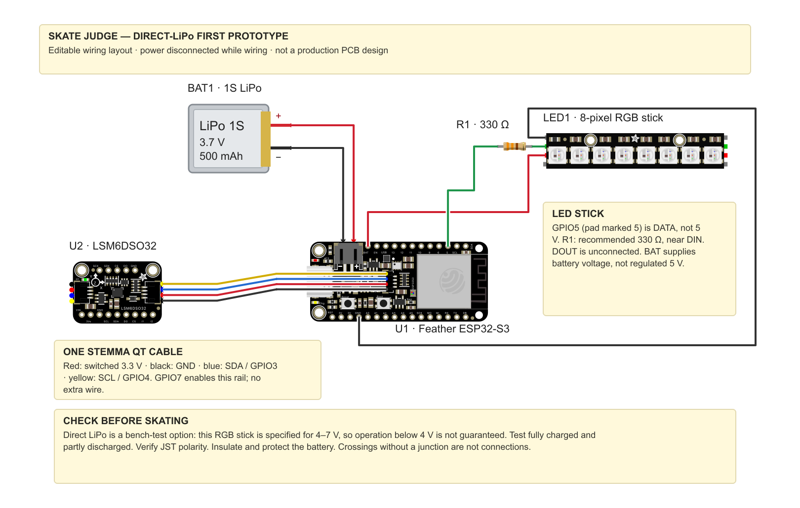

# Editable skateboard wiring project

Open **[skate-judge-direct-lipo.fzz](skate-judge-direct-lipo.fzz)** in Fritzing.
It contains native components, electrical connections, movable wire bendpoints,
labels, and editable notes—not a flattened drawing. All five part definitions
and their artwork are bundled, including the three official Adafruit boards.
No separate part-library download is required to open the bundle.



## Open and edit

1. Install [Fritzing for macOS](https://fritzing.org/download/) if needed. The
   official prebuilt download requires a purchase; no purchase or application
   installation was performed as part of creating this project.
2. In Fritzing, use **File → Open** and select `skate-judge-direct-lipo.fzz`.
3. Select **Breadboard** view and zoom to fit. This is a direct-wired assembly;
   there is no physical breadboard in the drawing.
4. Move components, drag wire bendpoints, or edit the notes. The wires reference
   real part connectors, including the battery JST and STEMMA QT contacts.
5. Keep saving as **`.fzz`** so custom parts travel with the project. Use Save As
   for a new circuit variant before changing the power arrangement.

The `.fz` file is the initial uncompressed sketch for inspecting changes in Git.
The `.svg` and `.png` are generated previews, **not** the editable Fritzing source
and **not** exports from a running Fritzing application. After editing in Fritzing,
the saved `.fzz` is authoritative; these initial snapshots will not update themselves.

Only the breadboard wiring view is authored and reviewed. Schematic/PCB component
positions are provided, but those views are not routed or reviewed. This is not
a fabrication-ready PCB, a simulation, or a dimensional mounting template. The
battery graphic is a generic 1S 500 mAh illustration, not a model of your exact cell.

## Circuit represented

| Connection | Destination |
| --- | --- |
| 3.7 V / 500 mAh LiPo | Feather battery JST, correct polarity |
| Feather `BAT` | NeoPixel stick `5V` / `+` input; actual supply is battery voltage |
| Feather `GND` | NeoPixel stick `GND` |
| Feather pad **5**, GPIO5 | R1, **330 Ω**, then stick `DIN` |
| Stick `DOUT` | Unconnected |
| Feather STEMMA QT | IMU STEMMA QT: GND, switched 3.3 V, SDA/GPIO3, SCL/GPIO4 |

The four IMU wires represent **one STEMMA QT cable**. GPIO7 enables the Feather's
QT supply in firmware; it is not a fifth wire. The red QT wire is **not** the same
power net as red `BAT`. The 330 Ω resistor is the recommended data-input protection,
not an LED current-limiting resistor. Crossing lines are not connected unless they
meet at an electrical connector/junction.

This is the documented **direct-LiPo first test**, not the regulated 5 V alternative.
The stick's listed supply range is 4–7 V, so operation as a single LiPo discharges
below 4 V is not guaranteed. Test both fully charged and partly discharged before
relying on the sync flashes. Verify battery polarity and protect it from impacts.
See the [hardware reference](../../docs/recording.md#direct-lipo-wiring-for-the-first-test)
for the wiring caveats, manufacturer sources, and regulated-power alternative.

## Verification and reproducibility

The bundle was checked for valid XML, ZIP integrity, complete part/SVG references,
reciprocal wire connections, and the expected isolated electrical nets. In particular,
the checker rejects a bypassed/wrong data resistor, connections to DOUT/USB/3V, and
shorts between BAT, ground, QT power, SDA, SCL, and the two sides of R1. The preview
was rendered with Qt's SVG renderer and visually reviewed.

**Native Fritzing open/save testing has not been performed** because the application
was not installed in this environment. Check that it opens without missing-part
warnings and that wires stay attached when moving a board before relying on it as
your working project. Physical hardware operation is also not established by a diagram.

From the repository root:

```bash
python3 hardware/fritzing/validate_project.py hardware/fritzing/skate-judge-direct-lipo.fzz
python3 -m unittest discover -s tests -p test_fritzing_project.py -v
```

`build_project.py` recreates the **initial layout** from the checked-in parts using
Python's standard library. It refuses to overwrite an existing project by default:

```bash
python3 hardware/fritzing/build_project.py --output /path/to/new-preview-directory
```

The optional `--preview` additionally needs PyQt6 and produces a PNG. The internal
`--replace-generated` option deliberately overwrites the initial outputs and will
lose any hand edits to them; do not use it on your working Fritzing file.

## Parts and attribution

- Feather ESP32-S3, LSM6DSO32, and RGB NeoPixel Stick artwork/definitions:
  [Adafruit Fritzing Library](https://github.com/adafruit/Fritzing-Library), pinned
  at `7d905c3e982de3712c3033da4596cc71ea32de1c`. The Feather asset identifies the
  8 MB revision; the RGB stick asset is not the WWA or RGBW part.
- Standard resistor artwork/definition: Fritzing / Brendan Howell,
  [Fritzing parts](https://github.com/fritzing/fritzing-parts), pinned at
  `e64ffe973e92176b989ab390ab668638a85ee305`. R1's native resistance property is 330 Ω.
- Generic battery illustration and arrangement: skate-judge contributors.
- Upstream URLs and archive hashes: [sources/provenance.json](sources/provenance.json).

The diagram, bundled artwork, and generic battery part are distributed under
**Creative Commons Attribution–ShareAlike 3.0 Unported**. Attribution is also inside
the `.fzz`; see [the license](sources/CC-BY-SA-3.0.txt) and
[Fritzing's graphics notice](sources/Fritzing-LICENSE.txt). This notice does not
relicense the firmware or the rest of the repository.
